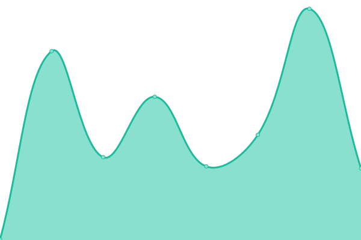
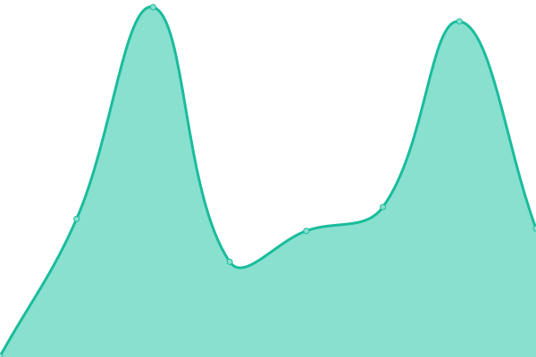
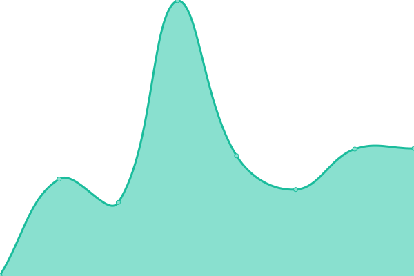

# SceneCheck Status

This repository contains the status page for [SceneCheck](https://scenecheck.app), powered by [Upptime](https://github.com/upptime/upptime).

Live status: [status.scenecheck.app](https://status.scenecheck.app)

<!--start: status pages-->
<!-- This summary is generated by Upptime (https://github.com/upptime/upptime) -->
<!-- Do not edit this manually, your changes will be overwritten -->
<!-- prettier-ignore -->
| URL | Status | History | Response Time | Uptime |
| --- | ------ | ------- | ------------- | ------ |
|  [API](https://api.scenecheck.app/api/health) | 🟨 Degraded | [api.yml](https://github.com/MrPenn/scenecheck-status/commits/HEAD/history/api.yml) | 

 15597ms
     
 | 

<a href="https://status.scenecheck.app/history/api">0.00%</a>
    

|  [Website](https://scenecheck.app) | 🟩 Up | [website.yml](https://github.com/MrPenn/scenecheck-status/commits/HEAD/history/website.yml) | 

 2931ms
     
 | 

<a href="https://status.scenecheck.app/history/website">98.65%</a>
    

|  [Admin Panel](https://admin.scenecheck.app) | 🟩 Up | [admin-panel.yml](https://github.com/MrPenn/scenecheck-status/commits/HEAD/history/admin-panel.yml) | 

 227ms
     
 | 

<a href="https://status.scenecheck.app/history/admin-panel">100.00%</a>
    

<!--end: status pages-->
